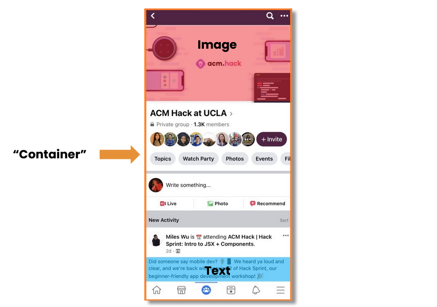
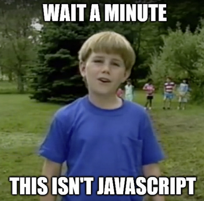
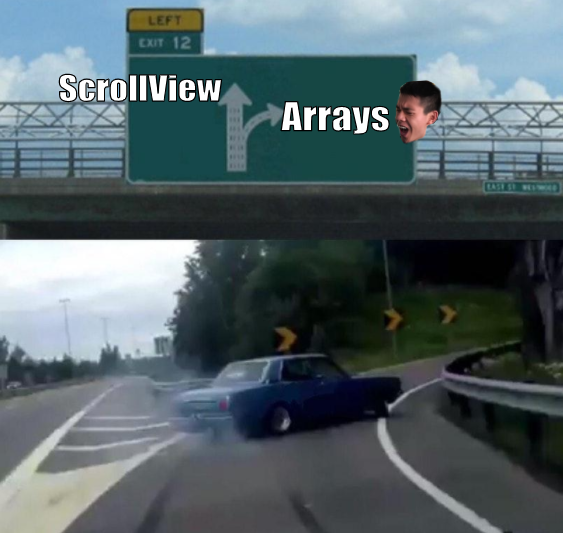
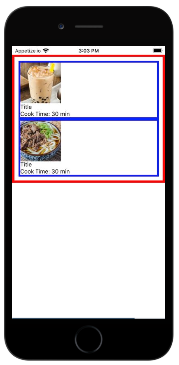
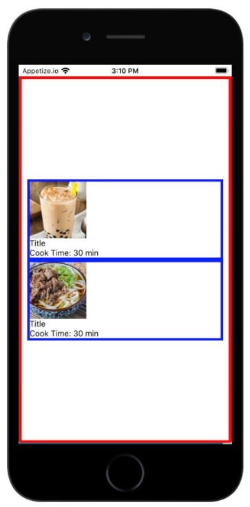
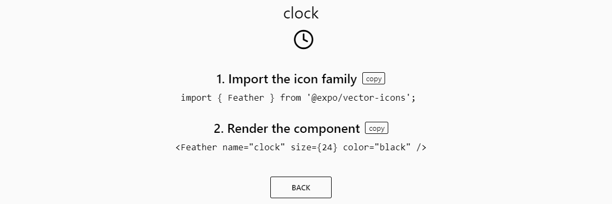
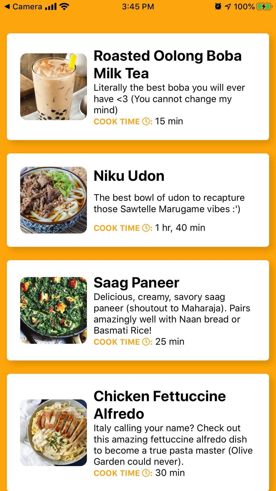

# Hacksprint Session 2: Intro to JSX and Basic Components

**Date**: January 20, 2021

**Location**: Zoom

**Teachers**: [Nareh Agazaryan](https://github.com/nareha), [Miles Wu](https://github.com/milesswu)

## Resources

- <a href="https://tinyurl.com/hacksprint21-s2-slides" target="_blank">Slides</a>
- <a href="https://members.uclaacm.com/login" target="_blank">ACM Membership Attendance Portal</a>

## What we'll be learning today

- [Components in React Native](#components-in-react-native)
  - [Basic Components](#basic-components)
  - [Intro to JSX](#intro-to-jsx)
  - [Finished Demo](./final_files/BasicComponents.js)
- [View Components](#view-components)
  - [SafeAreaView](#safeareaview)
  - ~~[ScrollView](#scrollview)~~
    - [Quick Detour: Arrays](#arrays)
  - [FlatList](#flatlist)
  - [Finished Demo](./final_files/ListComponents.js)
- [StyleSheets](#stylesheets)
  - [FlexBox Layout](#flexbox-layout)
  - [Finished Demo](./final_files/FlexBoxSimple.js)
- [Third Party Components](#third-party-components)
  - [Finished Demo](./final_files/RecipeDemo.js)
- [Do-It-Yourself Activity](#diy-activity)

## Components In React Native

Previously, we learned about what React Native is and how we can create amazing applications using it. Now, let's get into how React Native apps are made!

### Basic Components

Fun fact: The Facebook application is (mostly) written in React Native! Let's take a look at the lovely ACM Hack Facebook group page and see if we can get an idea of what makes up an application.



Well, there's an image with the ACM Hack logo at the top of the page, text within each post, and there is some sort of container holding all the content in the page. There may even be containers holding each of the posts as well! All of these parts come together and build on one another to become the application! It would be quite convenient if these were provided for us to build off of. Well, I have some good news for you!

Image, Text, and the "Container" (which we'll later define as View) are some basic components of React Native! But what exactly are components? Components are like **building blocks** for all the content on your screen. Think of a Lego set that has many parts for a specific purpose that come together to build the final product for that set. Components work in that way. We can piece together components that have a specific purpose to create our application! As we saw with Facebook, there can be many components within even just one screen or page of an application!

As basic components we can find these inside of a package called `react-native`. This package holds many prebuilt components provided by the React Native developers. As we saw in the Facebook example, there are a few basic components that are used quite often!

- View: This is like the container from earlier! It created an empty container (a blank canvas) to put other components inside!
- Text: Displays text
- Image: Displays images

There are of course many basic components that can be found [here](https://docs.expo.io/versions/v40.0.0/react-native/view/)!

### Intro to JSX

Components are pretty cool! But how do we actually use components in our code?

Well first, we must **import** these components into our code. Importing lets us use components from other files. In the case of basic components, the developers of React Native have prebuilt components and provided it to use in the `react-native` package from earlier. Lucky us!


There is a certain way in which we must import these basic components. We start the line with `import`. Then, in curly braces we put which components we want from `react-native` specifically. Now the file we have imported this in knows what these components are and they are ready to be used in our code!

Now that we have these components, we must use it in the code. React Native is built on JavaScript, so let's do the following!

```js
let phrase = <Text>Hacc Time!</Text>;
```

And this is a perfectly valid thing to do! Now phrase is `Text` that says "Hacc Time!". But hold on... this isn't JavaScript. Don't you have to wrap strings in quotation marks???



While it is not *exactly* JavaScript, it is a very fancy thing called JSX! JSX stands for JavaScript XML (which stands for Extensible Markup Language, which is just a fancy way of saying it's some information wrapped in tags that's easily readable for both humans and computers). The previous statement isn't allowed in JavaScript, but JSX lets us write code more efficiently, since we can directly put what we want inside of these components and use them effectively.

JSX can be used within JavaScript functions as well! Here we see some function `HelloWorld` that will give us this text and display it when we call it.

```js
const HelloWorld = () => { 
  return <Text>Hello, world!</Text>
}
```

Something super cool that we can do with JSX and components is that we can put JavaScript values and expressions inside of JSX! Take the following set of code:

```js
const name   = "React Native";
const phrase = <Text>{name} is super awesome!</Text>;
```
If we didn't have that curly brace, `phrase` would just state "name is super awesome!". However, the curly braces tells us and JSX that we want to use a JavaScript value inside of our `<Text>` component. Now, if we choose to display `phrase`, the result will be "React Native is super awesome!".

JSX is super handy in making working with components in our code easy to write and use!

## View Components

Now that we have an idea of how to use some of the basic React Native components, let's talk about some Views! And no, I'm not talking about views like the one from Janss Steps at sunset.

Views in React Native are a particular class of components which all act pretty much like an empty container (or "canvas") for other components to populate (just like how the regular `<View>` component works). However, there are many different kinds of View components we can use, all created for specific purposes. Today, we'll look at some of the more basic/important views.

### SafeAreaView

The SafeAreaView is a view that we usually use an an alternative to the outermost `View` component in an app. Just like a `View`, the SafeAreaView is an empty container. What sets it apart from the regular `View` is that everything inside of a SafeAreaView will be kept within the "safe area" of the phone screen.

#### What is the Safe Area?

Now, we said that the SafeAreaView helps keep content inside the "safe area," but what does that even mean? Let's illustrate using the picture below:


As we can see, the "safe area" is defined by all the space on the screen that does not include things like headers, the status bar, etc.

So that's neat, but why is this useful? Well, without the SafeAreaView, we run the risk of having our components (text, images, etc) show up within those unsafe areas. For example, our app's text could overlap directly with the clock text in the status bar, which to say the least would be ugly if not unreadable. We can see these issues more clearly in the image below:


In this instance, the text on the screen ends up *behind* the notch at the top of the iPhone. This is definitely not good, and so we want to avoid this by using the SafeAreaView component. In the code, this would look something like:

```js
import React from 'react';
import { SafeAreaView } from 'react-native';

export default function App() {
  return (
    <SafeAreaView>
      {/* Other components */}
    </SafeAreaView>
  );
} 
```

Note: SafeAreaView is currently only supported on iOS (sorry Android) 
### ScrollView
Alright, on to the next view! So if you've been messing around a little bit with components in React Native, you might have noticed that eventually when you add enough components, things start to go off the screen. Intuitively, you would try to scroll down to see the rest of your content.

*Cue dramatic music* **DUN DUN DUN**, turns out you won't be able to scroll at all and you'll be left stuck with content beyond the screen, somewhere in the void :(

We solve this issue by using a ScrollView, which is used to render (display on screen) lists of components and enables scrolling! Huh? Wait a minute... *LISTS(???)* of components? I don't think we've learned about how to represent lists of items in JavaScript yet. Oh shoot, looks like we'll have to take a quick detour here. If you already know about arrays, we still recommend you at least take a look at the [Map Function](#the-map-function) section. Otherwise, feel free to skip over to [rendering lists of components](#flatlist).


### Arrays
Arrays in JavaScript are collections of values stored in a sequential way. We refer to each value in an array as an "element" of the array. Generally, arrays are useful for storing large amounts of data ~~(*ahem* like lists of components *ahem*)~~. So we need to know at least some of the basics of arrays before we get into ~~ScrollView~~FlatList. 
#### Creating Arrays
In JavaScript, the syntax for creating arrays is pretty simple. Just like any other type of value, we can assign arrays to variables like so:
```js
let emptyArr = []; // this is an empty array
let numbers = [1,2,3,4];
let favFoods = ['boba', 'curry', 'soy sauce chicken'];
// note we can have arrays with different types of values
let builtDifferent = [2021, '8-clap', false, 85.0]; 
```

#### Accessing Array Elements
If we want to lookup a specific element of our array, we can do what's called "array indexing." Essentially, each element in an array is associated with some "index" number starting from 0 and going up by 1 (hence, arrays are collections of values stored sequentially). Let's visualize this:


So, the syntax for getting a specific element from an array is as follows:
```js
// General syntax: arr_name[index_num]
// Example:
let numbers = [1,2,3,4];
console.log(numbers[0]) // prints 1
console.log(numbers[3]) // prints 4
```
#### Array Operations
Here are some other basic array operations we can perform. It's okay not to memorize these, you can always look up all the possible operations with the help of the [MDN Docs](https://developer.mozilla.org/en-US/docs/Web/JavaScript/Reference/Global_Objects/Array#) or the internet in general.

- `arr.length`: gives the number of elements in an array
- `arr.push(someVal)`: adds a new element to the end of the array
- `arr.pop()`: removes the last element from the array

#### The Map Function
The Map Function! (*insert "Can you find the Mountain?" Dora joke here*)

The Map Function is a very commonly used array operation within React/React Native development. What it lets us do is create a new array using the elements of an already existing one. In doing so, we can manipulate the elements of an array to look however we want! Woah, okay slow down there tiger (*did i just call myself tiger?*) , what the hecc does any of that even mean?

Let's try to make this less abstract using an example. Take the following code:
```js
let names = ['Eugene', 'Miles', 'Nareh'];
let greetings = names.map(
  (name) => {
    return 'Hello, my name is ' + name;
  }
);
console.log(greetings);
```

Okay, you might be thinking "I thought you said you were gonna slow down, what gives?" but don't worry let's break down the above example step by step.

Firstly, we create a `names` array from the first line:
```js
let names = ['Eugene', 'Miles', 'Nareh'];
```
This array just contains three strings, pretty standard stuff. The next line, we are creating a new array variable called `greetings`. We do this using the map function.
```js
let greetings = names.map(...)
```
This section of the code just means that we want to apply the map function to the `names` array. In other words, we want to use the values in `names` to create a new set of values `greetings`. Then we have:
```js
.map(
  (name) => {
    ...
  }
)
```
The map function takes an argument, which as we can see is another function. So we supply a function to the map function using arrow syntax (Recall: `const foo = () => {/* code here */}`). This function takes one argument, which we'll call `name`. What is this function for, you might ask. Well the function we supply to the map function is going to be applied to every element in the original `names` array. Let's keep going:
```js
(name) => {
  return 'Hello, my name is ' + name;
}
```
So as we can see, this function takes a `name` and then returns a string using that `name` argument. Whatever we return from this function is going to be what the values in our result array `greetings` will look like. This means that we should expect all the values in `greetings` to look something like `'Hello, my name is ___'` but replace `___` with one of the names from the `names` array.

Once again, altogether, we can use the map function as follows:
```js
let greetings = names.map(
  (name) => {
    return 'Hello, my name is ' + name;
  }
);
console.log(greetings);
// This will print the following array:
/*
  [
    'Hello, my name is Eugene',
    'Hello, my name is Miles',
    'Hello, my name is Nareh'
  ]
*/
```

Hopefully, you can see that this will be useful for us when we start to think about how we can transform data so that it can be displayed as a list of components on screen.
### FlatList
Alrighty, after that ~~not so~~ quick detour, we can finally come back to talking about ScrollView. Oh wait, why is the title of this section FlatList? Oh that's right, it's because FlatLists do the same thing as ScrollViews... but **better**.

Seriously though, FlatLists are also containers whose purpose is to display a list of components. The different is that FlatLists will load components **"lazily"**, meaning that only the components that can actually be seen on screen at a given time are loaded. The rest load as you scroll down. This is in contrast to ScrollView, which attempts to load the entire list at once. As you can imagine, this is extremely inefficient and causes performance issues when dealing with very large lists. Because of this, we're gonna go ahead and forget about ScrollView completely and stick to FlatList from now on.

#### Using FlatLists
To use a FlatList, we first have to have some array of data. See the [ListComponents demo file](./final_files/ListComponents.js) for a full example. Here, I have already created an array of recipe data. We're gonna go ahead and use this for our FlatList. Here's the syntax:

```js
<FlatList
  data={recipes}
  renderItem={(obj) => {
      return (
          <View>
              <Image 
                  style={{
                      width: 100,
                      height: 100
                  }}
                  source={{
                      uri: obj.item.img_uri
                  }}
              />
              <Text>{obj.item.title}</Text>
              <Text>Cook Time: {obj.item.cook_time}</Text>
          </View>
      );
  }}
/>
```

Let's break this down. So the first thing is that the `<FlatList />` component takes a prop `data`. This prop refers to the array of data you want to manipulate and display on the screen. The next is the `renderItem` prop. This prop takes a function that returns some JSX. You can very much think of this function as similar to how the function that the array map function takes as an argument. Here, the function we pass in takes a JavaScript object `obj` as an argument. One of the properties of this object is called `item` and we use this property to refer to one of the items in our `data` array (recipes in this case).

So what I return from this function is the JSX that corresponds to how I want each recipe in my `recipes` array to end up looking like on the screen. I use specific properties from my recipe data to display things like the "Cook Time," "title," and even an image of the dish. 
## StyleSheets
So far we've been talking a lot about the content that goes onto your app's screen, represented by different components. Now that we have a basic grasp of using components, let's shift our focus to learning how we can change their appearance and layout.

Stylesheets are what React Native uses to create and apply style rules to different components on a screen. We represent a stylesheet using a JavaScript object (usually a `styles` object) that contains some sets of style rules. Don't worry if some of that didn't make any sense, we'll get a better idea of what this all means as we go.
### Creating StyleSheets
Before we actually create any stylesheets, we have to import the `StyleSheet` object from `'react-native`'. So, at the top of the `App.js` file, we'll make sure we have the following line of code:
```js
import { StyleSheet } from 'react-native';
```

Now that we have this, we can create our stylesheet reference. Below is an example of what this might look like:
```js
const styles = StyleSheet.create({
  container: {
    backgroundColor: 'pink'
  }
});
```

So what's going on here? First of all, we are creating a variable called `styles` which will act as our stylesheet from now on. What we assign to the variable is the result from using the `StyleSheet.create()` function.

This `create()` function takes in an object, and this object just like any other object has properties and values. It just so happens that each of these properties also maps to another object. 

To make this less confusing, let's refer to the outer object as the style object. Inside of this style object we have a bunch of named styles (the style object's properties). Each of these named styles has a corresponding set of style rules. 

In our example, `container` is one of the named styles and it corresponds to one style rule `backgroundColor: 'pink'`. In this way, we can create a bunch of different names for different sets of style rules so that we can refer to the more easily. This is all wrapped up in the `styles` variable for us.
### Using StyleSheets
Now that we know how to create our stylesheet, let's go ahead and see how we can apply one of our sets of style rules to a component. Every component in React Native has a style property that can be specified. So, for example, if we want to apply the style rules from the "container" style we made we can do something like:
```jsx
<View style={styles.container}>
  {/* other components */}
</View>
```

And now, this particular View component will have a pink background color. Additionally, we can also apply multiple styles to a component by simply passing in an array of styles instead:
```jsx
<View style={[styles.container1, styles.container2]}>
  {/* other components */}
</View>
```

In these cases, the styles later in the array will take precedence over the styles earlier in the array.

#### Some Basic Style Properties
Below is a list of some of the common style properties. Again, don't feel the need to memorize these, Google is your friend and here is also a nice [React Native Styles Cheatsheet](https://github.com/vhpoet/react-native-styling-cheat-sheet) for your reference.

- `backgroundColor`: component's background color
- `color`: text color
- `fontSize`: text size
- `margin`: space between components
- `padding`: space a component takes up
- `borderWidth`: thickness of border around a component
- `borderColor`: color of border
- `borderRadius`: adds rounded corners to a border

#### A Word on Cascading
If you are familiar with CSS, be careful not to confuse React Native stylesheets with cascading style sheets. Stylesheets in React Native do not always cascade. They only do so when the parent and child components are the same type of components (i.e. both a View, both a Text, etc). If you do not know what this means, don't worry about it, it's not necessary to using stylesheets.
### FlexBox Layout
Let's talk about flexbox, which is what React Native uses for its components. If you've never heard of flexbox, the simple explanation is that flexbox is just a particular way that we can specify where components are positioned and how components are laid out on the screen. You can check out the [full docs](https://reactnative.dev/docs/flexbox) for more specific information, but we will just be going over some of the basic ways to use flexbox today.
#### Flex Direction
The most basic part of using flexbox is specifying the direction in which components are laid out. There are two primary directions we use, called 'column' and 'row,' which we can see below:


The flexDirection specified is also referred to as the "main axis" (or the axis on which components are aligned on). Flex Direction is usually relevant when we have a container (like a View) with many components inside of it and we would like to manipulate the layout of those components. For example:
```jsx
export default function App() {
  return (
    <View style={styles.container}>
      <View style={styles.box}>
        <Text>1</Text>
      </View>
      <View style={styles.box}>
        <Text>2</Text>
      </View>
      <View style={styles.box}>
        <Text>3</Text>
      </View>
    </View>
  );
}

const styles = StyleSheet.create({
  container: {
    flexDirection: 'row'
  },
  box: {
    padding: 10
  }
});
```
The above snippet will layout the three nested Views in a row format. Note that the default direction for all React Native components is 'column' so if I did not specify a flex direction then the three nested components would be stacked on top of each other.
#### Alignment
One of most common things you will likely want to do when developing an app is trying to center components (whether its centering on the screen as a whole or within some nested component). Good news! Flexbox gives us easy ways to specify the alignment of components. We'll go ahead and take a look at how this works:

- `justifyContent`: alignment on the main axis 
  - corresponds with flexDirection
- `alignItems`: alignment on the "cross" axis
  - perpendicular to flexDirection (i.e. column's cross axis is row)

The above items are two style properties that we can specify to determine the alignment of components. As an example, they might be used like so:
```jsx
export default function App() {
  return (
    <View style={styles.container}>
      <View style={styles.box}>
        <Text>1</Text>
      </View>
      <View style={styles.box}>
        <Text>2</Text>
      </View>
      <View style={styles.box}>
        <Text>3</Text>
      </View>
    </View>
  );
}

const styles = StyleSheet.create({
  container: {
    flexDirection: 'row',
    justifyContent: 'center',
    alignItems: 'center',
    height: 300,
    borderWidth: 1
  },
  box: {
    padding: 20,
    borderWidth: 5
  }
})
```
In the above example, the three nested components will be arranged in a row layout. `justifyContent` here will center the three components horizontally within the parent View. `alignItems` here centers them vertically within the parent View. This ends up looking something like: 


#### flex: 1
A not on using flexbox, often times the alignment properties we use will not appear to work properly when we first try them out. Frantically scratching your head, you might spend hours trying to figure out why (*sad confused noises*). Here is our attempt to hopefully reduce the amount of time you spend in frustrated confusion. Enter `flex: 1`. This style property indicates that components shuld take up as much of the available space as possible (at least along the parent's main axis).

In the situations where flexbox alignment "appears" to not be working, we can do some clever things to see that in fact flexbox is working as expected but the parent View you are using to align child Views is actually just not taking up enough space for the alignment properties to make a noticeable difference. 

Let's take the below example:



Here we have a two Views nested inside of another view. Everything here has borders so hopefully it's clear to see that the parent View actually only takes up about half the screen. This will be true for most situations: components will only usually take up as much space as they need to fit their content. But we can see that if you tried to center these components vertically, it wouldn't do anything since they already are "centered" in the parent View.

How do we fix this? Well, we can use `flex: 1`. Putting `flex: 1` on the parent View here will extend it to fill the remaining vertical space on the screen. Thus, centering vertically now will put both child components in the middle of the screen, like so:


## Third Party Components
We've talked a TON about React Native componenets, how to use them, how to style them, how to lay them out, etc. Let's take a small breather here and do something a little more fun. We're gonna talk a little bit about third party components, specifically Expo components.

Now, since React Native is a framework built to let us avoid native mobile development and instead use JavaScript, we lose some of the power of native languages like swift or java/kotlin. In particular, we lose access to many of the mobile features like your phone's camera, push notifications, google/apple maps, and even its built in Accelerometer.

What many of Expo components do is allow us to still have access to these features. So using these will be important for mobile-driven development in the future. For now, we will not go too much into these since many of them require us to use asynchronous JavaScript which we have not done yet but will go over in a future session.

For now, we will stick to one of the more fun Expo components, which is [Vector Icons!](https://docs.expo.io/guides/icons/). Using these is actually pretty easy, if you created your project with `expo init` then you can access all types of icon components from the `@expo/vector-icons` package.

To find an icon you want and how to use it, we can browse the Expo [Vector Icon Directory](https://icons.expo.fyi/). Once we find one, it will tell us exactly how to use it, like so:


## DIY Activity
Alright *whew*, we've gone through a lot lot lot of content in this session, but one of the best ways to learn some of these skills is to get your hands dirty and do it yourself! So we encourage you to make a basic app about something! 

Feel free to take a look at the [Expo Docs](https://docs.expo.io/versions/v40.0.0/react-native/image/) to see more examples of how to use components. Also take a look at the [React Native Styles Cheatsheet](https://github.com/vhpoet/react-native-styling-cheat-sheet) to see a full list of style properties and what they do. 

Ideas for what to make:
- An app to show off your favorite animals, foods, places to visit, etc.
- An app that displays your reviews of movies you've watched
- A gallery of photos revolving around some topic (kind of like a timeline)

Example - a recipes app:

